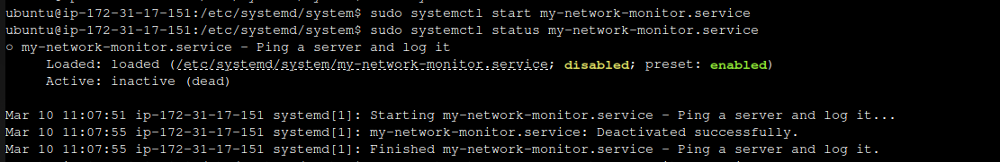
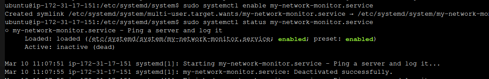
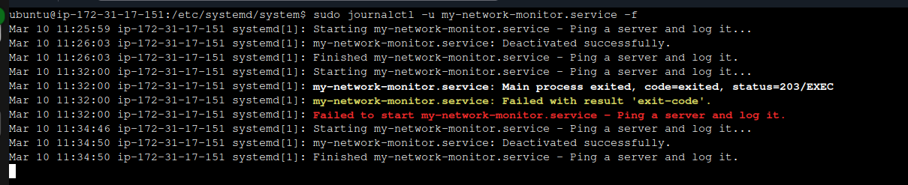
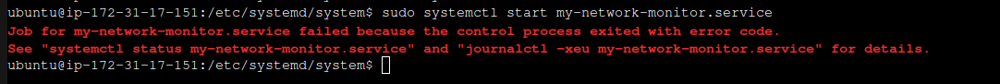
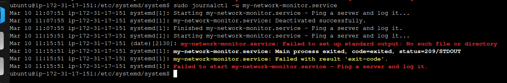
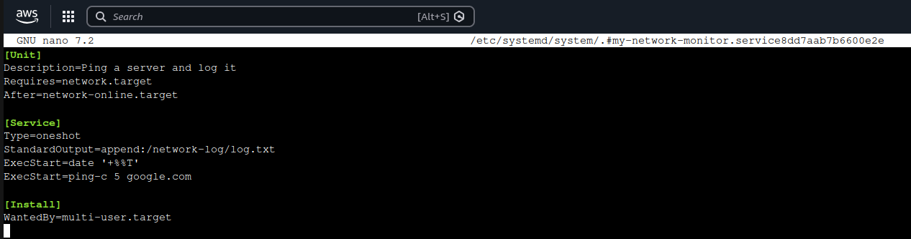
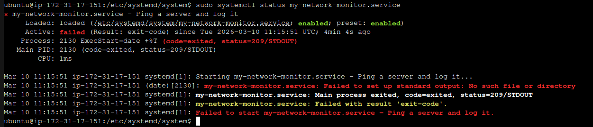
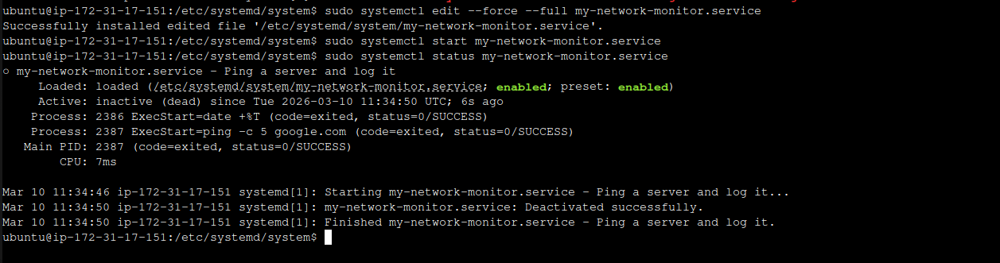
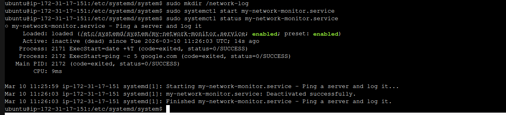
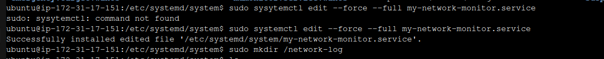

# TITLE: **Custom Systemd Service Management**

## **PROJECT OVERVIEW**

This project demonstrates how to create, configure, and manage custom servicecs using systemd. The project shows how Linux administrators automate processes, control service startup, and monitor system services which include:

- Creating a custom service
- Automatically starting service on boot
- Managing services using systemctl
- Logging with journald
- Troubleshooting services

## Tools Used

- Linux (AWS Instance Ubuntu)
- systemd
- systemctl
- journalctl

### step1: Create a Systemd Service File

    sudo nano /etc/systemd/my-network-monitor.service

    mkdir network-log/log.txt


### step2: Reload Systemd

    sudo systemctl daemon-reload
    


### step3: Start the Service

    sudo systemctl start my-network-monitor.service

    sudo systemctl status my-network-monitor.service



### step4: Enable Service at Boot

> sudo systemctl enable my-network-monitor.service


### step5: View Logs

    journalctl -u my-network-monitor.service

   

### step6: Troubleshooting

    sudo systemctl status my-network-monitor.service



    sudo journalctl -u my-network-monitor.service



### Issue Faced: misconfig, and errors

> Service failed to start: 






> systemctl status my-network-monitor.service


> sudo systemctl edit --force --full my-network-monitor.service


### Solution1: **Corrected the error by typing space between ping and -c save and exit.**




### Solution2:**Corrected the error by creating a network-log in / directory (/network-log) **
```
mkdir /network
systemctl start my-network-monitor.service
systemctl status my-network-monitor.service
```


### Reconfigure the unit

> sudo systemctl daemon-reload

    sudo systemctl enable my-network-monitor.service
    sudo systemctl start my-network-monitor.service
    cat /network-log/log.txt




### Definition of Command Used

- [x] `systemctcl:` used to control the system and service manager(start, stop, status, enable or disable services).
- [x] `journalctl:` used to query and view logs collected by systemd-journald daemon.
- [x] `nano:` command-line text editor
- [x] `mkdir:` make directory

### What I Learned
- [x] Service management
- [x] Service monitoring
- [x] System troubleshooting 
